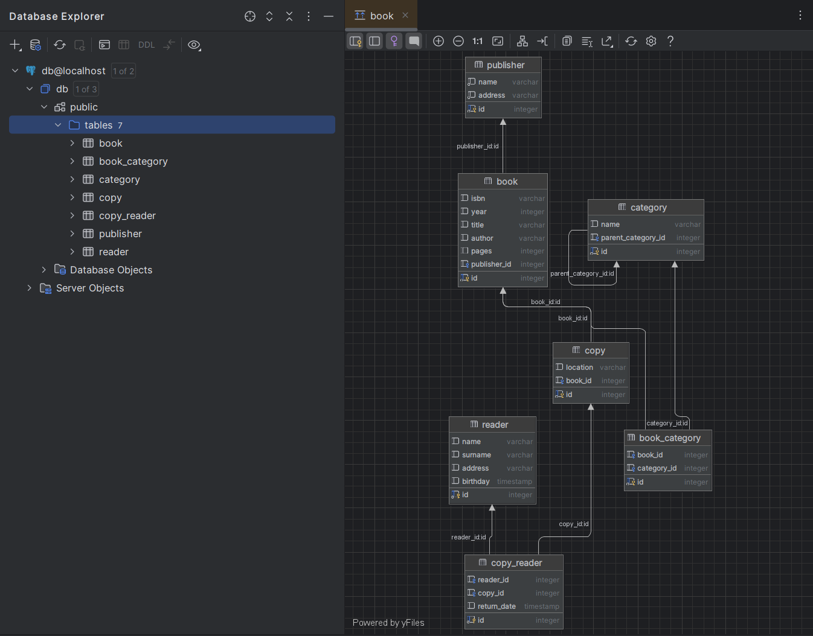
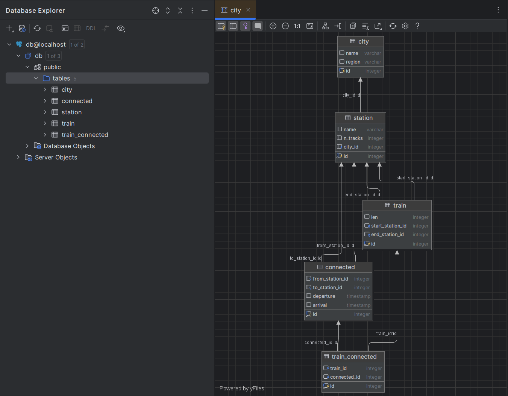
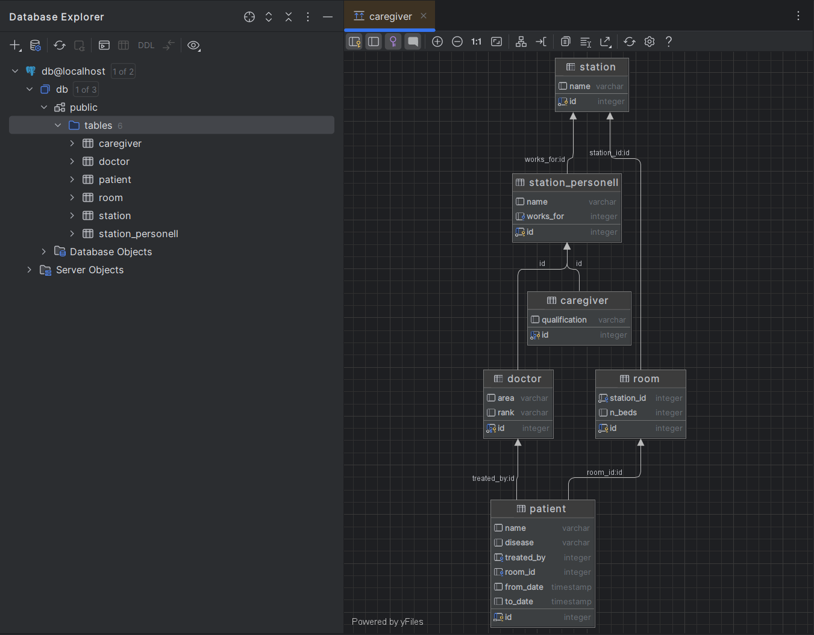

# ДЗ часть 2

## Описание

`library.sql`, `trains.sql`, `hospital.sql` - SQL-запросы для создания соответствующих таблиц.

## Запуск БД в Docker

```
PS C:\Users\Administrator\university\c3\db\sem_04\2> docker compose up -d
[+] Running 4/4
 ✔ Network 2_default        Created  0.1s 
 ✔ Container psql-trains    Started  1.0s 
 ✔ Container psql-hospital  Started  1.0s 
 ✔ Container psql-library   Started  1.0s
```

Результат (диаграммы в DataGrip):



