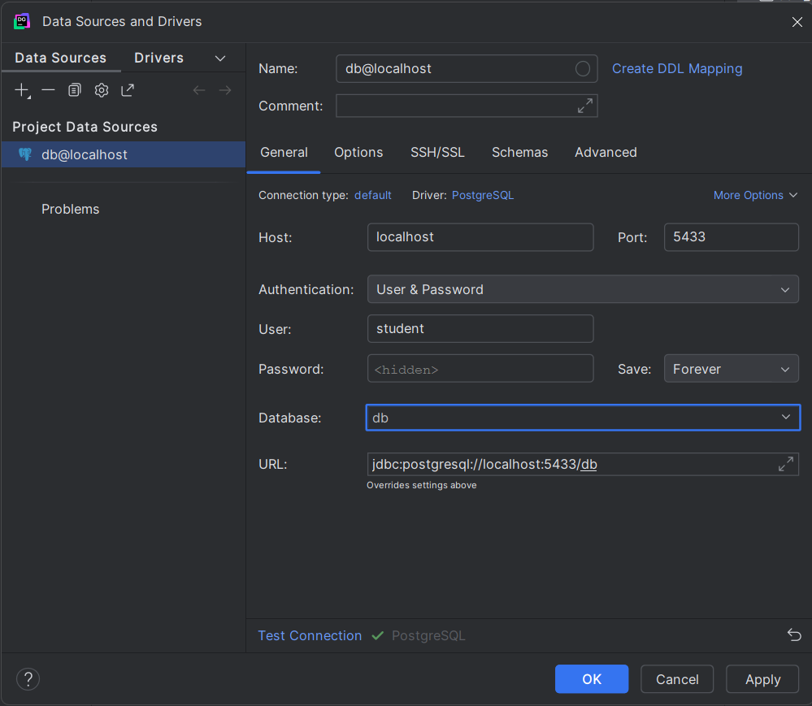
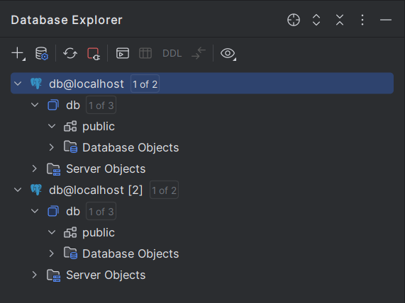
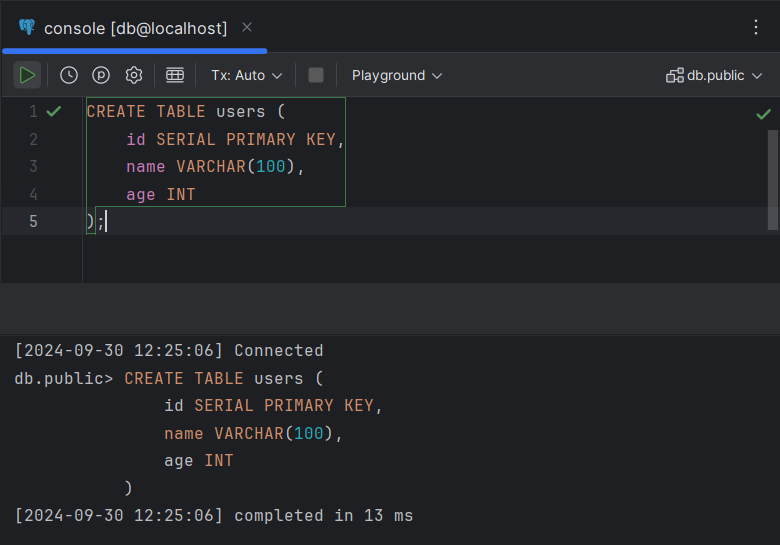
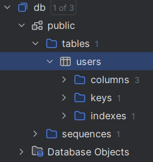
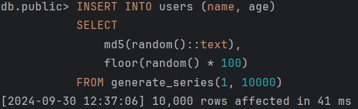
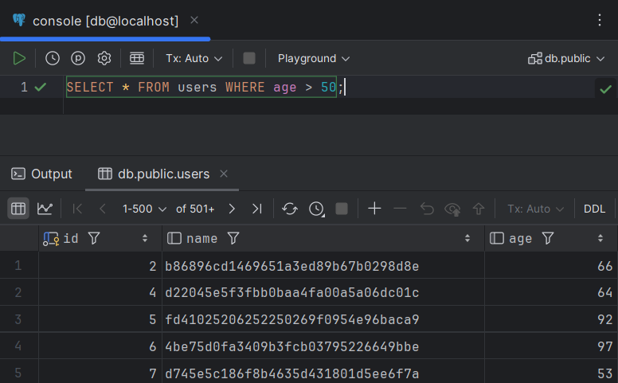
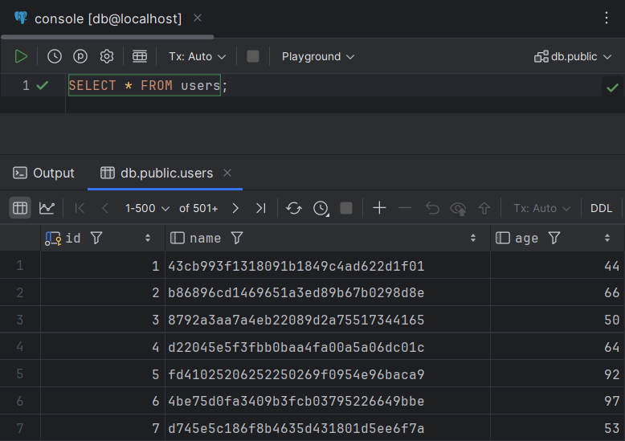

# ДЗ:

## 1. Создается docker-compose.yml с двумя сервисами: PostgreSQL

См. файл `docker-compose.yml` или его содержимое ниже:

```yaml
services:

  psql-1:
    container_name: psql-1
    image: postgres:alpine
    ports:
      - 5433:5432
    environment:
      POSTGRES_USER: student
      POSTGRES_PASSWORD: student
      POSTGRES_DB: db

  psql-2:
    container_name: psql-2
    image: postgres:alpine
    ports:
      - 5434:5432
    environment:
      POSTGRES_USER: student
      POSTGRES_PASSWORD: student
      POSTGRES_DB: db
```

## 2. Загрузите туда данные

Поскольку загружать данные мы будем через DataGrip, то здесь просто запустим оба сервиса:

```
PS C:\Users\Administrator> docker compose up -d
[+] Running 3/3
 ✔ Network src_default  Created  0.0s 
 ✔ Container psql-1     Started  0.5s 
 ✔ Container psql-2     Started  0.5s 
```

## 3. Подключитесь к базе данных через DataGrip

Подключаемся к БД `psql-1` и `psql-2`:


*Настройка подключения к БД `psql-1`*


*Структура БД сразу после подключения*

## 4. Выполните тестовые SQL-запросы

Выполним тестовые запросы на БД `psql-1`:


*Выполнение запроса на создание таблицы `users`*


*Новая структура БД*


*Генерация произвольных записей*


*Отбор всех пользователей старше 50 лет*


*Все записи из `users`*

## 5. Удалите контейнеры

```
PS C:\Users\Administrator> docker compose down
[+] Running 3/3
 ✔ Container psql-2     Removed  0.5s 
 ✔ Container psql-1     Removed  0.7s 
 ✔ Network src_default  Removed  0.3s
```

## 6. Сделайте скриншоты и опишите результаты

Контейнеры удалены, сервисы больше недоступны:

```
PS C:\Users\Administrator> docker ps -a
CONTAINER ID   IMAGE     COMMAND   CREATED   STATUS    PORTS     NAMES
```

## 7. Запустите контейнеры снова и проверьте, что данные остались или нет

Запускаем контейнеры:

```bash
PS C:\Users\Administrator> docker compose up -d
[+] Running 3/3
 ✔ Network src_default  Created  0.0s 
 ✔ Container psql-1     Started  0.6s 
 ✔ Container psql-2     Started  0.6s
```

Заходим в один из них:

```
PS C:\Users\Administrator> docker ps -a
CONTAINER ID   IMAGE             COMMAND                  CREATED              STATUS              PORTS                    NAMES
295dffc682ba   postgres:alpine   "docker-entrypoint.s…"   About a minute ago   Up About a minute   0.0.0.0:5433->5432/tcp   psql-1
1de4acd8b7c9   postgres:alpine   "docker-entrypoint.s…"   About a minute ago   Up About a minute   0.0.0.0:5434->5432/tcp   psql-2
PS C:\Users\Administrator> docker exec -it 29 bash
```

Далее подключаемся к БД через утилиту `psql` и пробуем обратиться к таблице `users`:

```
295dffc682ba:/# psql -U student -d db
psql (17.0)
Type "help" for help.

db=# select * from users;
ERROR:  relation "users" does not exist
LINE 1: select * from users;
                      ^
```

Как видим, данные не сохранились.


## 8. Сделайте скриншоты и опишите результаты

Данные не сохранились, поскольку не был использован ни один volume. Так что после удаления контейнеров все их данные (в том числе и данные о записях в БД) были утеряны. 