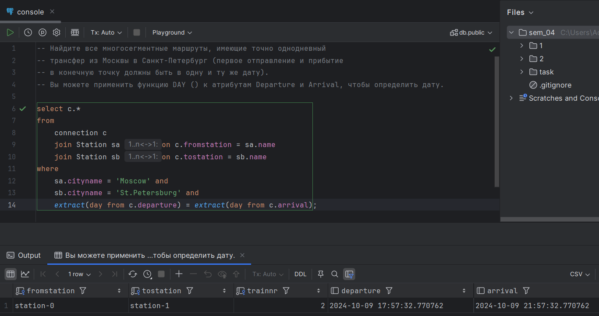

# Task 1

## Запуск контейнера с БД

```bash
cd ./1
docker compose up -d
```

## Заполнение БД данными

Команда ниже заполнит БД произвольными данными (генерация зависит от `seed`'a):

```bash
python3 insert.py
```

## Запросы

Запросы можно посмотреть в `./1/sql`, или ниже:

```sql
-- Какие фамилии читателей в Москве?

select LastName from Reader where Address like 'Moscow';
```
```sql
-- Какие книги (author, title) брал Иван Иванов?

select b.Author, b.Title
from
    Borrowing bw
    join Reader r on r.ID = bw.ReaderNr
    join Book b on b.ISBN = bw.ISBN
where
    r.FirstName = 'Иван' and
    r.LastName = 'Иванов';
```
```sql
-- Какие книги (ISBN) из категории "Горы" не относятся к категории "Путешествия"?
-- Подкатегории не обязательно принимать во внимание!

select a.ISBN
from BookCat a
where
    a.CategoryName = 'Горы'
    and not exists (
        select 1
        from BookCat b
        where
            a.ISBN = b.ISBN and
            b.CategoryName = 'Путешествия'
    );
```
```sql
-- Какие читатели (LastName, FirstName) вернули копию книги?

select r.LastName, r.FirstName
from
    Borrowing bw
    join Reader r on r.ID = bw.ReaderNr
where bw.ReturnDate < CURRENT_DATE;
```
```sql
-- Какие читатели (LastName, FirstName) брали хотя бы одну книгу (не копию),
-- которую брал также Иван Иванов (не включайте Ивана Иванова в результат)?

with IvanIvanovBooks as (
    select ISBN
    from Borrowing
    where ReaderNr = (
        select ID
        from Reader
        where
            FirstName = 'Иван' and
            LastName = 'Иванов'
    )
)
select r.LastName, r.FirstName
from
    Reader r
    join Borrowing bw on r.ID = bw.ReaderNr
    join IvanIvanovBooks iib on iib.ISBN = bw.ISBN
where
    not (r.FirstName = 'Иван' and r.LastName = 'Иванов');
```

## Результаты выполнения запросов


# Task 2

## Запуск контейнера с БД

```bash
cd ./2
docker compose up -d
```

## Заполнение БД данными

Команда ниже заполнит БД произвольными данными (генерация зависит от `seed`'a):

```bash
python3 insert.py
```

## Запросы

Запросы можно посмотреть в `./1/sql`, или ниже:

```sql
-- Найдите все прямые рейсы из Москвы в Тверь.
-- (учитывая, что есть транзитивное замыкание)

select c.*
from
    Connection c
    join Station sa on c.fromstation = sa.name
    join Station sb on c.tostation = sb.name
where
    sa.cityname = 'Moscow' and
    sb.cityname = 'Tver';
```

```sql
-- Найдите все многосегментные маршруты, имеющие точно однодневный
-- трансфер из Москвы в Санкт-Петербург (первое отправление и прибытие
-- в конечную точку должны быть в одну и ту же дату).
-- Вы можете применить функцию DAY () к атрибутам Departure и Arrival, чтобы определить дату.

select c.*
from
    connection c
    join Station sa on c.fromstation = sa.name
    join Station sb on c.tostation = sb.name
where
    sa.cityname = 'Moscow' and
    sb.cityname = 'Tver' and
    extract(day from c.departure) = extract(day from c.arrival);
```

## Результаты выполнения запросов


